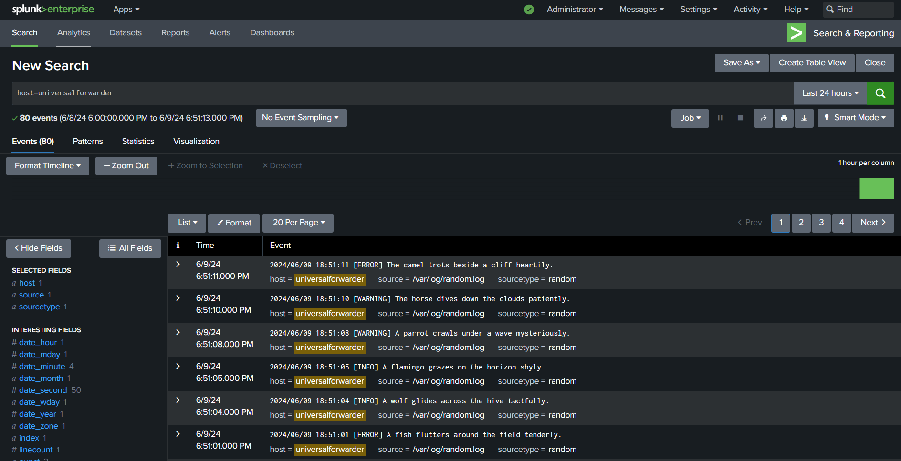

# Splunk Universal Forwarder (UF)

As described in the `docker-compose.yml`, this setup leverages three different resources within three Docker containers:
1. **Standalone Splunk**: Acts as the indexer
2. **Universal Forwarder**: Forwards logs to the indexer
3. **Logger**: Writes random logs to the `/var/log/random.log` file

## I. Prerequisites
- **Docker** must be installed on your system.
- **Docker Compose** must be installed on your system.

## II. Launching
To launch the containers, use this command, replacing `<complex_password>` with a secure password:
```sh
SPLUNK_PASSWORD=<complex_password> docker-compose up -d
```

It takes a few minutes for all containers to launch properly. You can check their status using the `docker container ls` command.

## III. Testing log indexing
1. Open a web browser and go to `http://localhost:8000`


2. Log in with the username `admin` and the password you set (`<complex_password>`).
3. Navigate to **Search & Reporting**


4. Click on **Data Summary**


5. Select the host **universalforwarder** to view incoming logs


6. Verify the logs are received



## IV. Debugging Commands
Here are some useful commands for debugging:

- View Universal Forwarder container logs:
```sh
docker container logs universalforwarder
```
- Connect to the Universal Forwarder container:
```sh
docker exec -it universalforwarder bash
```
- Retrieve the IP address of the Universal ForwarderF:
```sh
docker inspect -f '{{range .NetworkSettings.Networks}}{{.IPAddress}}{{end}}' universalforwarder 
```
- Test connectivity between the Universal Forwarder and the indexer:
```sh
docker exec universalforwarder ping indexer
```
- Check if the Universal Forwarder is receiving logs from the logger
```sh
docker exec universalforwarder tail -f /var/log/random.log
```

## V. Alternative: Installing the Universal Forwarder on a Linux Server
To install the Universal Forwarder on a Linux server, follow these steps:
- Download the Universal Forwarder:
```sh
wget -O splunkforwarder-9.2.1-78803f08aabb-Linux-x86_64.tgz "https://download.splunk.com/products/universalforwarder/releases/9.2.1/linux/splunkforwarder-9.2.1-78803f08aabb-Linux-x86_64.tgz"
```
- Extract it to the `/opt` directory:
```sh
sudo tar xvzf splunkforwarder-9.2.1-78803f08aabb-Linux-x86_64.tgz -C /opt
```
- Switch to the **splunk** user
```sh
sudo su splunk
```
- Add the indexer as a forward server:
```sh
/opt/splunkforwarder/bin/splunk add forward-server splunk-indexer:9997                                                              
```
```plaintext
Warning: Attempting to revert the SPLUNK_HOME ownership
Warning: Executing "chown -R veben:veben /opt/splunkforwarder"
Splunk username: admin
Password:
Added forwarding to: 172.17.0.3:9997.
```
- Verify the configuration:
```sh
cat /opt/splunkforwarder/etc/system/local/outputs.conf
``` 
```plaintext
[indexAndForward]
index = false

[tcpout]
defaultGroup = default-autolb-group

[tcpout:default-autolb-group]
server = 172.17.0.3:9997

[tcpout-server://172.17.0.3:9997]
```
- Add monitoring for the `/var/log/random.log` file
```sh
./opt/splunkforwarder/bin/splunk add monitor '/var/log/random.log'
```
```plaintext
Warning: Attempting to revert the SPLUNK_HOME ownership
Warning: Executing "chown -R veben:veben /opt/splunkforwarder"
Your session is invalid.  Please login.
Splunk username: admin
Password:
Added monitor of '/var/log/*'.
```